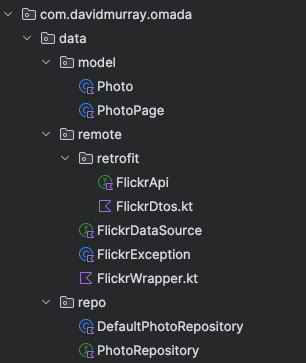
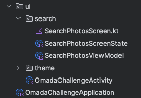
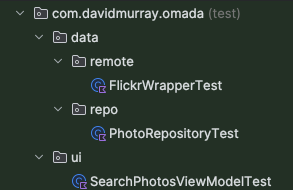

## Omada Health Interview Take-Home

Flickr API display for Omada Health coding challenge.

—

For this challenge, I opted to use MVVM architecture, Jetpack Compose and Kotlin. 
I used Retrofit for the Flickr API calls, and Glide to display images. 

I first wrote up a set of steps that I intended to correlate to commits, in order to improve readability and simplify development. I didn’t quite make it 1:1 with commits, but the steps were as follows:

1. Initial commit & Android Project
2. Domain models & Remote layer + conversions
3. Unit tests for Remote layer + conversions
4. PhotoRepository layer
5. Unit tests for PhotoRepository layer
6. PhotoSearch Screen & ViewModel
7. Unit tests for PhotoSearch ViewModel
8. UI & Code polish, commenting, etc.
9. PhotoDetail Screen & ViewModel + navigation* (if time allows)
10. README, submission, video upload
  
—  
# Code
  
**DATA LAYER**  
The **FlickrApi** interface is the key functionality, using Retrofit to map API responses to the **FlickrDtos** data classes. **FlickrWrapper** then translates them into the associated domain models used by the rest of the data layer and user interface. The **PhotoRepository** isn’t strictly necessary in this context, but this layer is included as its standard in development. The **ViewModel** in the UI uses the repository to get data based on success/fail of the API calls.
  

  

  
**UI LAYER**   
The **SearchPhotosScreen** is the View that uses the **SearchPhotosScreenState** provided by the **ViewModel**. It uses Glide to download and display the images from the URLs provided by the API extras. When nearing the bottom of the list, another pull of the data is triggered to pull the next page of Photo data from the API. The ViewModel tracks this and handles calls accordingly.
  

    
**UNIT TESTS**  
I wrote unit tests for the ViewModel, Repository and data-conversion layers, abstracting those classes to interfaces so they could be mocked in unit tests.
   
  
—  
# Videos  

[Overview](https://drive.google.com/file/d/1hxKohzvv8TicGvilmMXuiod-PFZl_gL0) —   
This video gives an overview of the classes in the application and shows usage matching the above description of the application. I know the description specifies two videos, but I have a couple extra too.  
  
[Expansion](https://drive.google.com/file/d/109y9nF_h46n6_4HrM4s5HHWp9TLLADbX) —   
The original intention in my step 9 was to not just display the image, but to use Retrofit and the data layer to implement the [Photo.getInfo](https://www.flickr.com/services/api/flickr.photos.getInfo.html) function and include further metadata like description and date posted. This was scrapped due to time, and my simple implementation to just display (which is in the video) wasn’t functional enough to commit to the repository on time.  
  
[AI Usage in Development](https://drive.google.com/file/d/1L6q0IJZmo_lBWkize-Nab312J5TgDOa4) —   
I strongly believe that AI is most useful to a developer as a tool, and a developer is able to speed up and strengthen their deliverables by using something like ChatGPT or Gemini. It’s not something that can be used to fully write code, you still need to know what you’re doing overall to be most effective with it. I use it sometimes to provide a base for a portion of code I’m writing or to explain something that I don’t understand how it works.  
  
[Example Development](https://drive.google.com/file/d/1JmiEXLfVCW5qaqH6Pi-lxMqudB5xs9rI) —  
It was requested that development be filmed in some capacity, so this shows me adding a new class at 2x speed.
